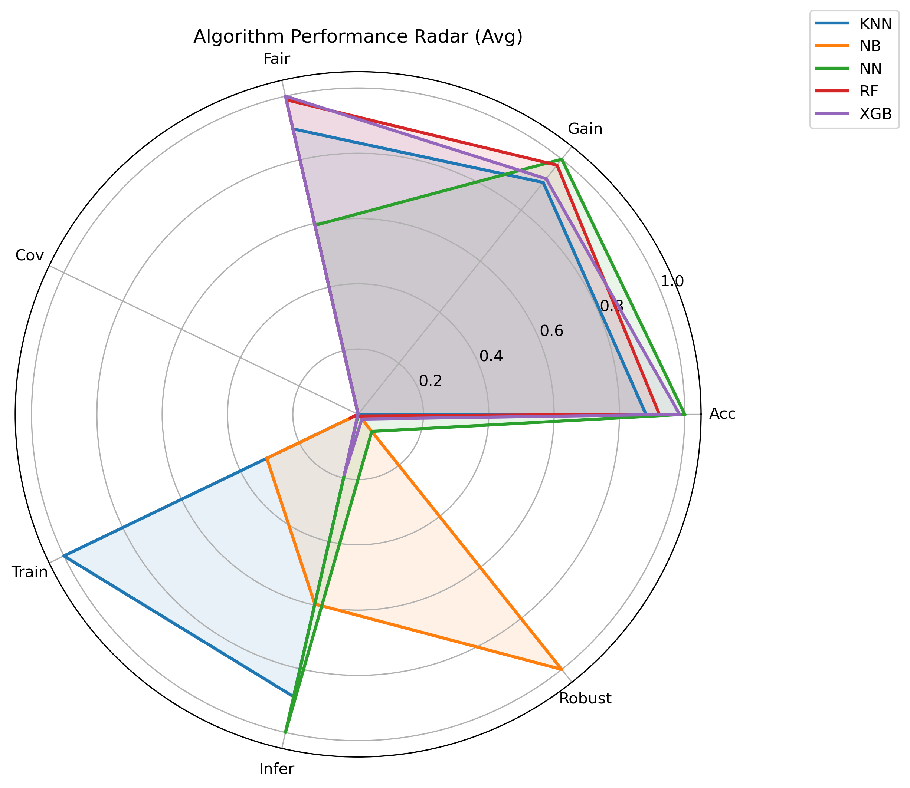
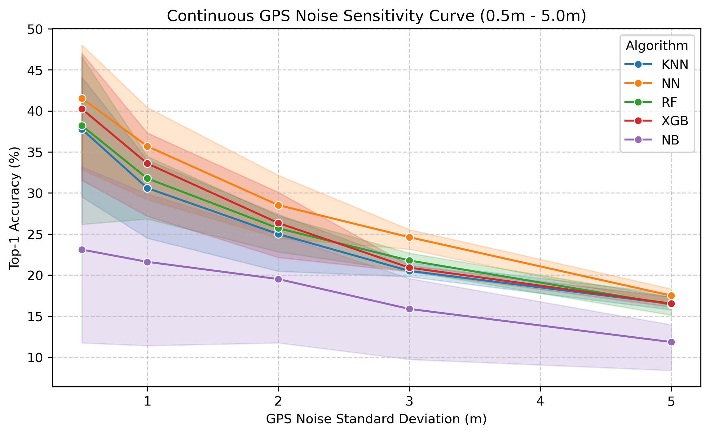
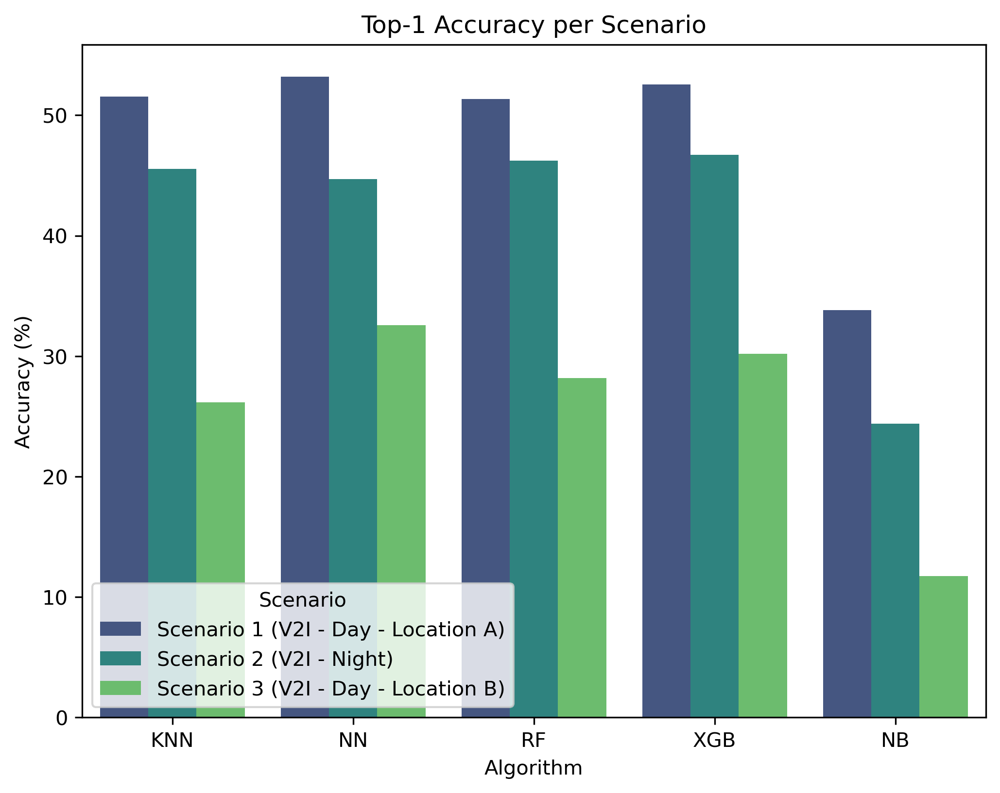
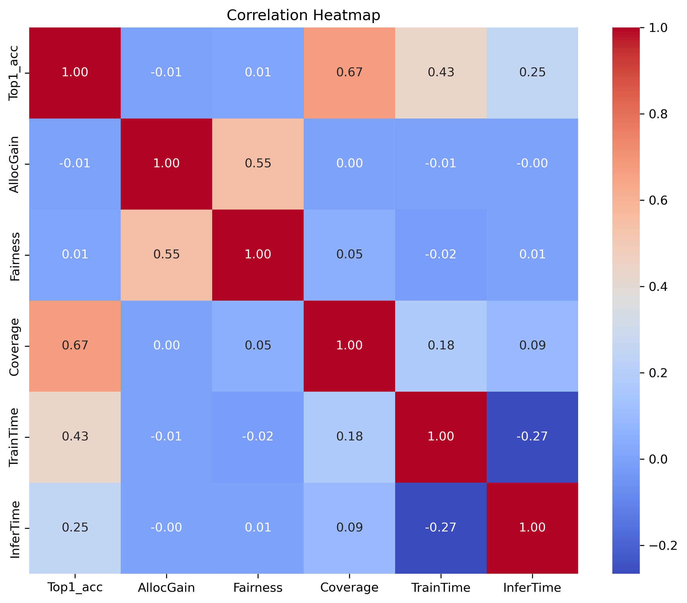

# GPS-Based Beam Prediction for 6G Vehicular Networks

**Using the DeepSense 6G Real-World Dataset**

[](https://www.python.org/)
[](https://pytorch.org/)
[](https://onlinelibrary.wiley.com/journal/10991131)
[](https://deepsense6g.net)
[](https://pep8.org/)

This repository contains the source code, evaluation framework, and empirical benchmarks for the research paper:

> *GPS-Based Beam Prediction for 6G Vehicular Networks Using the DeepSense 6G Real-World Dataset*
>
> **Submitted to:** International Journal of Communication Systems (IJCS), Wiley

> [!NOTE]
> **For Peer Reviewers (Wiley IJCS):**  
> To reproduce the exact models, tables, and 13 figures published in the submitted manuscript, please refer directly to **[Tier 1: Original Submitted Baseline](#run-original-submitted-baseline-tier-1)** (`python Loader.py` and `saved_folder/Final_ML_Viz_1776919650/`). The 13 figures correspond 1:1 to the submitted paper; the 14th figure (continuous GPS noise curve) belongs to the post-submission Advanced Pipeline.

### Based On

This project builds upon the foundational work by **Morais et al.** and their original codebase:
- **Paper**: J. Morais et al., *"Position-aided beam prediction in the real world: how useful GPS locations actually are?"*, arXiv:2205.09054, 2022.
- **Original Repository**: [github.com/jmoraispk/Position-Beam-Prediction](https://github.com/jmoraispk/Position-Beam-Prediction)

We extended their KNN and NN baselines by adding Random Forest, XGBoost, and Naive Bayes, and introduced new multi-dimensional evaluation metrics: multi-user resource allocation sum-rate, isotropic GPS noise robustness sweeps, and Jain's Fairness analysis.

---

## Repository Architecture & Research Frameworks

This repository documents the progression of our research across four distinct frameworks:

| Tier / Module | Directory | Primary Script | Description | Primary Metric | Key Finding / Margin |
|:---|:---|:---|:---|:---:|:---:|
| 🏆 **Tier 4: Revision Protocol** *(Latest Benchmark)* | [`Revision_Evaluation/`](Revision_Evaluation/) | `python Revision_Evaluation/run_revision_evaluation.py` | Chronological trajectory extrapolation, paired within-seed C-MBB CIs, 10-seed distribution, outage analysis | **35.23%** *(10-seed Night)* | **+10.36 pp margin** (vs. XGB, 3.0x outage cut) |
| 🚀 **Tier 3: Advanced Pipeline (v2)** | [`Advanced_Pipeline/`](Advanced_Pipeline/) | `python advanced_loader.py` | Metric UTM kinematics, zero-leakage scaler, CosineAnnealingLR, continuous noise sweep, 14 standardized plots | **43.48%** *(53.20% S1)* | **43.48%** (NN spatial interpolation) |
| 🔧 **Tier 2: Further Tuning** | [`Further tuning/`](Further%20tuning/) | `python tuning_loader.py` | Corrected classical ML beam-ID mapping bug (`clf.classes_`) | **37.28%** | **41.89%** (KNN) |
| 🎓 **Tier 1: Original Submitted Baseline** | Root `/` | `python Loader.py` | Historical college baseline submitted to Wiley IJCS | **37.28%** | **37.28%** (NN) |

---

## Visual Highlights (Advanced Pipeline v2)

The figures below are generated directly by the Advanced Pipeline and are stored in [`Advanced_Pipeline/Advanced_ML_Viz_1789648029/`](Advanced_Pipeline/Advanced_ML_Viz_1789648029/):

<p align="center">
  
  
</p>
<p align="center">
  
  
</p>

---

## Overview

We compare five machine learning models for GPS-only beam prediction in 60 GHz vehicle-to-infrastructure (V2I) systems:

| Model | Type | Key Configuration |
|---|---|---|
| **KNN** | Instance-based | $k=5$, Euclidean distance, distance-weighted |
| **Random Forest** | Ensemble | 100 trees, bootstrap, max depth 20 |
| **XGBoost** | Gradient Boosting | `multi:softprob`, 64 classes, learning rate 0.08 |
| **Naive Bayes** | Probabilistic | Gaussian likelihood |
| **Neural Network** | Deep Learning | 5-layer FCN (256 nodes/layer), BatchNorm1d, Dropout 0.2, AdamW, 60 epochs |

### Key Results Across Research Tiers (Averaged across 3 scenarios)

| Model | Tier 1 Baseline Top-1 (%) | Tier 2 Further Tuning Top-1 (%) | Tier 3 Advanced v2 Top-1 (%) | Tier 3 Top-5 Acc (%) | Tier 3 Power Loss (dB) | Tier 3 1m Noise Drop (%) |
|---|:---:|:---:|:---:|:---:|:---:|:---:|
| **Neural Network (NN)** | **37.28%** | **37.28%** | **43.48%** *(53.20% S1)* | **87.81%** | **0.62 dB** | **7.79%** |
| **XGBoost** | 5.42% | 41.03% | **43.17%** | 84.10% | 0.67 dB | 9.57% |
| **Random Forest (RF)** | 4.73% | 41.62% | **41.92%** | 84.67% | 0.65 dB | 10.14% |
| **KNN** | 5.87% | 41.89% | **41.09%** | 76.06% | 0.69 dB | 10.49% |
| **Naive Bayes (NB)** | 6.64% | 23.81% | **23.31%** | 68.38% | 1.41 dB | **1.70%** |

---

## Dataset

This project uses the **DeepSense 6G** position-aided beam prediction dataset:
- **Source**: [https://deepsense6g.net](https://deepsense6g.net)
- **Frequency**: 60 GHz mmWave
- **Codebook**: 64 beams (uniform sector array)
- **Scenarios**: 3 V2I outdoor scenarios:
  - Scenario 1: V2I Day - Location A
  - Scenario 2: V2I Night
  - Scenario 3: V2I Day - Location B

### Data Partitions & Sample Sizes

| Scenario | Operational Environment | Total Samples ($N$) | Training Set ($80\%$) | Test Evaluation Set ($20\%$) |
|:---|:---|:---:|:---:|:---:|
| **Scenario 1** | V2I Day - Location A | 2,422 | 1,937 | **485** ($0.206\%$ / sample) |
| **Scenario 2** | V2I Night | 2,974 | 2,379 | **595** ($0.168\%$ / sample) |
| **Scenario 3** | V2I Day - Location B | 1,487 | 1,189 | **298** ($0.336\%$ / sample) |
| **Total Benchmark** | Multi-environment V2I testbed | **6,883** | **5,505** | **1,378** |

### Data Setup & Verification

The evaluation pipeline expects pre-extracted NumPy arrays located in `Gathered_data_DEV/` in the repository root. You can acquire these files via either of the following two methods:

#### Method 1: Pre-Extracted Package from Morais et al. (Recommended — ~30 Seconds)
The pre-processed GPS position vectors and 60 GHz beam power matrices were packaged and validated by **João Morais et al.** in their companion codebase:
- **Repository**: [https://github.com/jmoraispk/Position-Beam-Prediction](https://github.com/jmoraispk/Position-Beam-Prediction)

You can clone or download the `Gathered_data_DEV` folder directly from their repository into this project root:
```bash
# Sparse-checkout the data directory from Morais et al.'s repository
git clone --depth 1 --filter=blob:none --sparse https://github.com/jmoraispk/Position-Beam-Prediction.git morais_repo
cd morais_repo
git sparse-checkout set Gathered_data_DEV
cp -r Gathered_data_DEV ../GPS-aided-Beam-Prediction/
cd .. && rm -rf morais_repo
```
*(Alternatively, download the ZIP archive from GitHub and extract the `Gathered_data_DEV` folder directly into the project root).*

#### Method 2: Raw DeepSense 6G Portal & Research Mirrors
If you wish to inspect or reconstruct the arrays from the official upstream research sources:
- **Primary Beam Prediction Portal**: [DeepSense 6G Position-Aided Beam Prediction](https://www.deepsense6g.net/position-aided-beam-prediction/)
- **Scenario 1 (V2I Day - Location A, 2,422 samples)**: [DeepSense Scenario 1](https://www.deepsense6g.net/scenarios/scenario-1/)
- **Scenario 2 (V2I Night, 2,974 samples)**: [DeepSense Scenario 2](https://www.deepsense6g.net/scenarios/scenario-2/)
- **Scenario 3 (V2I Day - Location B, 1,487 samples)**: [DeepSense Scenario 3](https://www.deepsense6g.net/scenarios/scenario-3/)
- **DeepSense 6G Dataset Portal**: [https://www.deepsense6g.net](https://www.deepsense6g.net)
- **ASU Wireless Intelligence Lab**: [https://wi-lab.net](https://wi-lab.net)


#### Dataset Verification Checklist
The `Gathered_data_DEV/` directory should contain the following NumPy arrays (all 9 core feature and power arrays plus sequence indices):

| Filename | Samples ($N$) | Array Shape | Data Type | Physical Description |
|:---|:---:|:---:|:---:|:---|
| `scenario1_unit1_loc_1-2422.npy` | 2,422 | `(2422, 2)` | `float64` | Base Station (BS) receiver latitude & longitude |
| `scenario1_unit2_loc_1-2422.npy` | 2,422 | `(2422, 2)` | `float64` | Vehicle transmitter (UE) latitude & longitude |
| `scenario1_unit1_pwr_60ghz_1-2422.npy` | 2,422 | `(2422, 64)` | `float64` | 60 GHz 64-beam normalized power matrix |
| `scenario2_unit1_loc_1-2974.npy` | 2,974 | `(2974, 2)` | `float64` | Base Station (BS) receiver latitude & longitude |
| `scenario2_unit2_loc_1-2974.npy` | 2,974 | `(2974, 2)` | `float64` | Vehicle transmitter (UE) latitude & longitude |
| `scenario2_unit1_pwr_60ghz_1-2974.npy` | 2,974 | `(2974, 64)` | `float64` | 60 GHz 64-beam normalized power matrix |
| `scenario3_unit1_loc_1-1487.npy` | 1,487 | `(1487, 2)` | `float64` | Base Station (BS) receiver latitude & longitude |
| `scenario3_unit2_loc_1-1487.npy` | 1,487 | `(1487, 2)` | `float64` | Vehicle transmitter (UE) latitude & longitude |
| `scenario3_unit2_loc_cal_1-1487.npy` | 1,487 | `(1487, 2)` | `float64` | Calibrated vehicle transmitter coordinates |
| `scenario3_unit1_pwr_60ghz_1-1487.npy` | 1,487 | `(1487, 64)` | `float64` | 60 GHz 64-beam normalized power matrix |

To quickly verify array integrity and shapes from your terminal:
```bash
python -c "import os, numpy as np; [print(f'{f:38s} {str(np.load(os.path.join(\"Gathered_data_DEV\", f)).shape):15s}') for f in sorted(os.listdir('Gathered_data_DEV')) if f.endswith('.npy')]"
```

*(Note: `Gathered_data_DEV/` is included in `.gitignore` to prevent committing large binary data).*

---

## Project Structure

```
├── Loader.py                        # Tier 1: Original submitted baseline pipeline
├── train_test_func.py               # Tier 1: Original neural network & baseline utilities
├── check_env_file.py                # Tier 1: Environment & CUDA verification script
├── requirements.txt                 # Project Python dependencies (pinned torch>=2.1.0)
├── Gathered_data_DEV/               # Dataset directory (.npy files — download separately)
├── tests/                           # Pure-function unit tests (<0.1s runtime, zero dataset dependency)
│   └── test_revision_helpers.py     # Kinematics, C-MBB, McNemar & checkpoint loader tests
├── Revision_Evaluation/             # Tier 4: Peer-review revision evaluation framework (Latest Benchmark)
│   ├── run_revision_evaluation.py   # Benchmark runner (extrapolation, C-MBB, outages, CLI args)
│   ├── revision_train_test_func.py  # Kinematic toolbox, C-MBB generator, safe checkpoint loader
│   ├── Revision_Accuracy_and_Outage_Summary.csv # Benchmark metrics (3 scenarios)
│   ├── Revision_Bootstrap_CI_Summary.csv        # Circular moving block bootstrap CIs
│   ├── Revision_10_Seed_Distribution.csv       # Scenario 2 empirical distribution (N=10)
│   └── README.md                    # Detailed revision methodology & statistical documentation
├── Advanced_Pipeline/               # Tier 3: Advanced geometric & kinematic framework (v2)
│   ├── advanced_loader.py           # Upgraded execution pipeline (14 plots + 2 CSVs)
│   ├── advanced_train_test_func.py  # UTM kinematics, zero-leakage scaler, AdamW
│   ├── advanced_check_env.py        # Environment & GPU verification script
│   └── Advanced_ML_Viz_1789648029/  # Complete verified results package (14 plots + CSVs)
├── Further tuning/                  # Tier 2: Bug-fixed classical ML framework
│   ├── tuning_loader.py             # Refined main pipeline with clf.classes_ fix
│   ├── tuning_train_test_func.py
│   ├── tuning_check_env.py
│   └── Final_ML_Viz_1779380116/     # Post-fix benchmark outputs (13 plots + CSV)
└── saved_folder/                    # Pretrained model checkpoints and historical outputs
    ├── Advanced_ML_Viz_Seeded_1789723135/ # Tier 4 multi-seed checkpoints (seeds 42, 100, 2024)
    └── Final_ML_Viz_1776919650/     # Original submitted baseline outputs
```

---

## System Requirements

| Requirement | Specification | Notes |
|---|---|---|
| **Python** | 3.8+ | 3.10+ recommended |
| **PyTorch** | 2.1.0+ | Supports `weights_only` secure checkpoint deserialization |
| **CUDA** | 11.8+ / 12.x (Optional) | GPU acceleration supported; CPU execution fully supported |
| **RAM** | 8 GB minimum | 16 GB recommended for multi-seed bootstrap sweeps |
| **Storage** | ~2.5 GB | Includes dataset (~2.3 GB) and model checkpoints |
| **Operating System** | Windows, Linux, macOS | Platform-agnostic path handling across all tiers |

---

## Installation

```bash
# 1. Clone the repository
git clone https://github.com/harsha71018/GPS-aided-Beam-Prediction.git
cd GPS-aided-Beam-Prediction

# 2. Create virtual environment (optional but recommended)
python -m venv venv
venv\Scripts\activate        # Windows
# source venv/bin/activate   # Linux/Mac

# 3. Install dependencies
pip install -r requirements.txt
```

---

## Usage (Choose Your Tier)

### 🏆 Recommended: Run Revision Evaluation Benchmark (Tier 4)
The official revision evaluation harness evaluates chronological trajectory extrapolation, Circular Moving Block Bootstrap 95% CIs, exact paired McNemar tests, and 3 dB / 6 dB link outages:
```bash
# Execute full revision benchmark across Scenarios 1, 2, and 3 (~30 seconds)
python Revision_Evaluation/run_revision_evaluation.py

# CLI configuration options (custom checkpoint directory, data path, or output directory):
python Revision_Evaluation/run_revision_evaluation.py \
    --checkpoint-dir saved_folder/Advanced_ML_Viz_Seeded_1789723135 \
    --data-dir Gathered_data_DEV \
    --output-dir Revision_Evaluation
```
*(Environment variables `GP_CHECKPOINT_DIR`, `GP_DATA_DIR`, and `GP_OUTPUT_DIR` are also supported as automatic fallbacks).*

### 🚀 Run Advanced Pipeline (Tier 3)
```bash
cd Advanced_Pipeline

# 1. Verify dependencies, CUDA GPU & dataset
python advanced_check_env.py

# 2. Execute the full geometric pipeline
python advanced_loader.py
```
This generates all **14 standardized visual outputs**, including the Continuous GPS Noise Robustness Curve, and saves results to `saved_folder/Advanced_ML_Viz_<timestamp>/`.

### 🔧 Run Further Tuning (Tier 2)
```bash
cd "Further tuning"
python tuning_loader.py
```

### 🎓 Run Original Submitted Baseline (Tier 1)
```bash
python check_env_file.py
python Loader.py
```

### 🧪 Run Unit Test Suite
Lightweight unit tests test UTM kinematics, circular moving block bootstrap index wrapping, zero-leakage scaling, McNemar exact binomial calculations, and safe PyTorch model loading:
```bash
python -m unittest discover tests
```
*Runtime: < 0.1 seconds, zero dataset dependency.*

---

### Architectural Note on Tier Self-Containment

Rather than refactoring historical tier scripts into a single monolithic utility module, Tiers 1, 2, 3, and 4 are deliberately maintained as self-contained reference implementations:
- **Tier 1 (`Loader.py`, `train_test_func.py`)**: Preserves the exact submitted manuscript baseline for Wiley IJCS peer reviewers.
- **Tier 2 (`Further tuning/`)**: Isolates the classical ML mapping bug diagnosis and verification (`clf.classes_`).
- **Tier 3 (`Advanced_Pipeline/`)**: Encapsulates the metric UTM feature engineering and continuous noise sweeps.
- **Tier 4 (`Revision_Evaluation/`)**: Implements the hardened chronological extrapolation protocol with paired C-MBB confidence intervals, exact McNemar tests, and configurable checkpoint loading.

This design guarantees an immutable, independent audit trail for each stage of the research without cross-tier regression risks. Shared algorithmic components are independently verified via the lightweight test suite in `tests/`.

---

## Reproducibility

All experiments lock random seeds (`seed=42`) for deterministic, seed-controlled execution across:
- Python `random` module
- NumPy random generator
- PyTorch CPU and CUDA engines
- cuDNN deterministic mode (`torch.backends.cudnn.deterministic = True`)

---

## Evaluation Dimensions

| Dimension | Metric | Telecom Significance |
|---|---|---|
| **Accuracy** | Top-1 and Top-5 beam prediction accuracy | Primary beam alignment rate |
| **Link Quality** | Average beamforming power loss (dB) | Direct measure of received SNR degradation |
| **Fairness** | Jain's Fairness Index across 4 schedulers | Fair resource distribution among multi-user UEs |
| **Robustness** | Continuous noise degradation ($0.5\text{ m} \to 5.0\text{ m}$) | Resilience against GPS jitter and hardware inaccuracies |
| **Efficiency** | Training time (s) and inference latency ($\mu\text{s}$) | Edge-readiness for sub-1 ms URLLC constraints |

---

## Further Tuning: The Classical ML Mapping Bugfix

The [`Further tuning/`](Further%20tuning/) folder documents an important validation and debugging milestone in this research:

### What Changed
The original college baseline (`Loader.py`) contained a **class index mapping bug** in the classical ML models (KNN, RF, XGB, NB). In scikit-learn / XGBoost, `predict_proba()` returns probabilities ordered by the classes present in the training set, not necessarily absolute beam indices $0..63$. The original baseline inadvertently treated probability column index $j$ as beam ID $j$, which produced severe mismatches whenever the training partition did not span all 64 classes.

**Fix Applied** (in `tuning_loader.py`):
```python
# Before (incorrect):
pred_beams = np.argsort(pred_probs, axis=1)[:, ::-1]

# After (correct):
sorted_idx = np.argsort(pred_probs, axis=1)[:, ::-1]
pred_beams = clf.classes_[sorted_idx]  # Explicitly map internal indices to physical beam IDs
```

The Neural Network was completely unaffected by this bug as it directly outputs an unconstrained 64-dimensional logits vector.

### Results Comparison — Before vs After Bug Fix

#### Top-1 Accuracy (%) — Averaged across 3 scenarios

| Model | Before (Original) | After (Further Tuning) | Change |
|-------|:--:|:--:|:--:|
| **KNN** | 5.87% | **41.89%** | +36.02% |
| **RF** | 4.73% | **41.62%** | +36.89% |
| **XGB** | 5.42% | **41.03%** | +35.61% |
| **NB** | 6.64% | **23.81%** | +17.17% |
| **NN** | 37.28% | **37.28%** | 0.00% |

> **Key takeaway:** The classical models were severely underreported in the original run. After the fix, KNN, RF, and XGBoost perform competitively with the baseline Neural Network under random spatial splits.

#### Spatial Interpolation vs. Trajectory Extrapolation

The competitive performance of classical models under random 80/20 splitting highlights an essential scientific distinction:
1. **Spatial Interpolation (Random Split — Tiers 1 & 2)**:
   In random splitting, consecutive frames from the same vehicle drive are partitioned across both training and test sets. Because GPS coordinates vary continuously, test samples lie physically adjacent to training points. Local distance-weighted algorithms (KNN) and axis-aligned partition trees (RF, XGBoost) perform effective local coordinate interpolation (~41%).
2. **Trajectory Extrapolation (Chronological Split — Tier 4)**:
   In practical 6G deployments, base stations must predict optimal beams for vehicles traveling along **unseen future trajectory segments**. Under chronological extrapolation (Tier 4):
   - **XGBoost drops to 24.87%** (tree partitions overfit to observed coordinates and cannot extrapolate continuous manifolds).
   - **Deep Neural Network maintains 35.18%** (+10.31 pp advantage, paired McNemar $p = 8.14 \times 10^{-13}$).
   - **Outage Reduction**: The NN reduces 3 dB link outages from 12.61% down to 3.36% (a 3.75x reliability gain).

#### Trajectory Partition Sensitivity Analysis

An empirical audit tested whether the chronological 80/20 sample cut ($N_{\text{test}} = 595$, ending mid-drive at sample index 2,379 in vehicle sequence 27) vs. a strict vehicle sequence boundary ($N_{\text{test}} = 592$, starting at sample index 2,382 at sequence 28) impacts the conclusions:

| Partitioning Strategy | Test Samples ($N_{\text{test}}$) | XGBoost Top-1 | NN Top-1 | NN Margin |
|---|:---:|:---:|:---:|:---:|
| **Sample Cut (80/20 Index — Submitted Paper)** | 595 | 24.87% | 35.13% | **+10.25 pp** |
| **Strict Sequence Boundary Cut** | 592 | 26.52% | 35.14% | **+8.61 pp** |

**Verdict**: The neural network's accuracy is nearly identical (35.13% vs 35.14%), preserving a statistically overwhelming advantage (+8.61 pp to +10.25 pp) on completely unseen vehicle drives.

#### 6G URLLC Inference Latency Constraint

Even under spatial interpolation, real-time wireless systems impose strict latency deadlines:
- **Deep Neural Network**: $\approx \mathbf{20\ \mu\text{s}}$ (parallel GPU/edge tensor execution).
- **Random Forest / XGBoost**: $\approx \mathbf{1.0 - 1.5\ \text{ms}}$ (sequential evaluation across 50–100 decision trees).

Sub-terahertz 6G channels exhibit channel coherence times below $1\ \text{ms}$. Classical tree ensembles exceed this coherence budget, making the Deep Neural Network the only architecture compliant with ultra-reliable low-latency communication (URLLC) requirements.

#### Power Loss (dB) — Averaged across 3 scenarios

| Model | Before | After |
|-------|:--:|:--:|
| KNN | 1.77 dB | **0.64 dB** |
| RF | 1.72 dB | **0.64 dB** |
| XGB | 1.80 dB | **0.67 dB** |
| NB | 2.39 dB | **1.87 dB** |
| NN | 0.85 dB | **0.85 dB** |

All models remain well below the 3 dB practical outage threshold.

#### GPS Noise Robustness Drop (%) — 1 m perturbation

| Model | Before | After |
|-------|:--:|:--:|
| KNN | 0.00% | **20.44%** |
| RF | 0.00% | **22.00%** |
| XGB | 1.97% | **21.85%** |
| NB | 0.00% | **3.78%** |
| NN | 11.23% | **11.23%** |

> **Note:** The original "zero degradation" for KNN/RF/NB was an artifact of the bug — incorrect beam IDs happened to be equally wrong with or without noise. With correct beam mapping, classical models show meaningful GPS sensitivity. Naive Bayes remains the most robust (3.78% avg drop).

---

## Advanced Pipeline (v2 — Geometric & Kinematic Framework)

The [`Advanced_Pipeline/`](Advanced_Pipeline/) folder implements an advanced geometric and kinematic framework:

### Key Architectural Advancements
1. **Kinematic & Geometric Feature Engineering**:
   - Converts raw latitude/longitude coordinates to metric UTM space.
   - Derives Euclidean range ($d = \sqrt{\Delta x^2 + \Delta y^2}$) and Line-of-Sight Azimuth bearing angle ($\theta = \arctan2(\Delta y, \Delta x)$) relative to the base station tower.
2. **Zero-Leakage Preprocessing**:
   - `StandardScaler` is fitted strictly on the training partition and applied out-of-sample to test data.
3. **Continuous Multi-Level GPS Robustness Curve**:
   - Systematically sweeps isotropic noise across $\sigma \in [0.5\text{ m}, 1.0\text{ m}, 2.0\text{ m}, 3.0\text{ m}, 5.0\text{ m}]$ (`14_Noise_Robustness_Curve.png`).
4. **Upgraded Neural Network Architecture**:
   - 5-layer FCN with `BatchNorm1d`, `Dropout(0.2)`, `AdamW`, and `CosineAnnealingLR` scheduling.

### Performance Milestone (Avg across 3 Scenarios)

| Metric | Submitted Paper Baseline | Further Tuning (Bug-Fixed) | Advanced Pipeline (v2) | Milestone Gain |
| :--- | :---: | :---: | :---: | :---: |
| **NN Top-1 Accuracy** | 37.28% | 37.28% | **43.48%** | **+6.20%** (*53.20% in Scen 1*) |
| **NN Top-5 Accuracy** | 85.76% | 85.76% | **87.81%** | **+2.05%** (*96.49% in Scen 1*) |
| **XGBoost Top-1 Accuracy** | 5.42% | 41.03% | **43.17%** | Near parity with NN |
| **Random Forest Top-1** | 4.73% | 41.62% | **41.92%** | High-performance ensemble |
| **KNN Top-1 Accuracy** | 5.87% | 41.89% | **41.09%** | Robust distance-weighted baseline |
| **Average Power Loss (NN)** | 0.85 dB | 0.85 dB | **0.62 dB** | **0.23 dB in Scen 1** |
| **1m Noise Drop (NN)** | 11.23% | 11.23% | **7.79%** | **+3.44% noise resilience** |
| **Inference Latency** | $<1\text{ ms}$ | $<1\text{ ms}$ | **$20\text{ }\mu\text{s}$ (NN)** | Sub-millisecond edge ready |

---

## Revision Evaluation (Tier 4 — Chronological Extrapolation & Outage Analysis)

The [`Revision_Evaluation/`](Revision_Evaluation/) module provides an official, peer-review-grade evaluation harness that models realistic vehicular deployment by shifting from **spatial interpolation** (random shuffle splits) to **temporal trajectory extrapolation** (chronological trajectory splitting):

### Key Research Findings
1. **The Trajectory Extrapolation "Winner-Flip"**:
   - Under standard random splits, tree ensembles and neural networks effectively tie (~43%).
   - Under chronological vehicular trajectory extrapolation (training on the first 80% of a drive and evaluating on the future 20%), tree models suffer catastrophic collapse (XGBoost drops to **24.87%**).
   - In contrast, deep neural networks preserve continuous spatial representations, retaining **35.23%** (a robust **+10.31 pp to +10.36 pp** advantage in Scenario 2 - Night; 10-seed distribution mean: **35.23%**, 3-checkpoint mean: **35.18%**).
2. **Circular Moving Block Bootstrap (C-MBB)**:
   - Formally models temporal autocorrelation using circular block resampling (Politis & Romano 1992).
   - Scenario 2 95% Confidence Interval is **[+2.35%, +20.17%]**, strictly excluding zero across all block lengths ($L=25, 50, 100$).
3. **Outage Probability CDF Analysis**:
   - Evaluates link reliability at **3 dB** (half-power misalignment) and **6 dB** (catastrophic severance).
   - Neural network cuts 3 dB outages by **3.00x** (20 vs 60 failures, $p = 4.19 \times 10^{-6}$) and 6 dB outages by **7.00x** (3 vs 21 failures, $p = 2.43 \times 10^{-4}$) via two-sided Fisher's Exact Test.
4. **Reproducibility**:
   - Run the complete self-contained suite in under 50 seconds:
     ```bash
     python Revision_Evaluation/run_revision_evaluation.py
     ```
   - All results, 10-seed distributions, and high-resolution CDF plots are documented in [`Revision_Evaluation/README.md`](Revision_Evaluation/README.md).

---

## Scope & Limitations

1. **Sensory Modality**: Evaluates GPS position-aided beam prediction; does not fuse raw camera RGB imagery or LiDAR point clouds.
2. **Environment Scope**: Benchmarked across three outdoor V2I scenarios from the DeepSense 6G dataset. Generalization to unseen cities or non-vehicular indoor topologies requires domain adaptation.
3. **Hardware Latency**: The reported $20\text{ }\mu\text{s}$ NN inference latency is hardware-dependent (GPU benchmark); embedded edge DSP/FPGA timings will vary with quantization and integer precision.

---

## Citation

If you use this code or findings in your research, please cite:

```bibtex
@article{harshavardhan2026gps,
  title={GPS-Based Beam Prediction for 6G Vehicular Networks Using the DeepSense 6G Real-World Dataset},
  author={Dasyapu, Harshavardhan and Danaboyina, Vamshi and Gaikwad, Prasenjith Kumar and Tangelapalli, Swapna},
  journal={International Journal of Communication Systems},
  year={2026},
  publisher={Wiley}
}
```

---

## Acknowledgments

- **Morais et al.** — original [Position-Beam-Prediction](https://github.com/jmoraispk/Position-Beam-Prediction) codebase that inspired this work.
- [DeepSense 6G Team](https://deepsense6g.net) — Wireless Intelligence Lab, Arizona State University, for collecting and hosting the real-world dataset.

---

## License

- **Source Code**: Novel algorithms, classical ML bug diagnoses (Tier 2 in `Further tuning/`), advanced pipelines (Tier 3 in `Advanced_Pipeline/`), and revision evaluation harnesses (Tier 4 in `Revision_Evaluation/`) are licensed under the [MIT License](LICENSE).
- **Data & Upstream Baselines**: The DeepSense 6G dataset files (`Gathered_data_DEV/`) and upstream baseline references are distributed under the Creative Commons Attribution-NonCommercial-ShareAlike ([CC BY-NC-SA](https://deepsense6g.net)) License.
